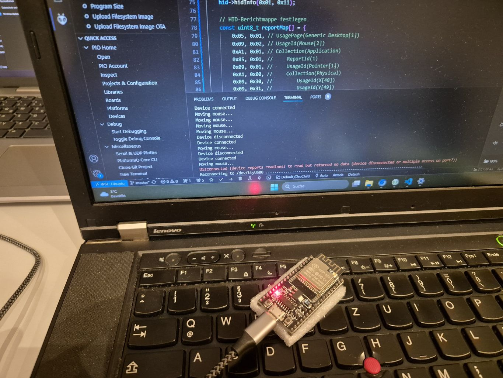
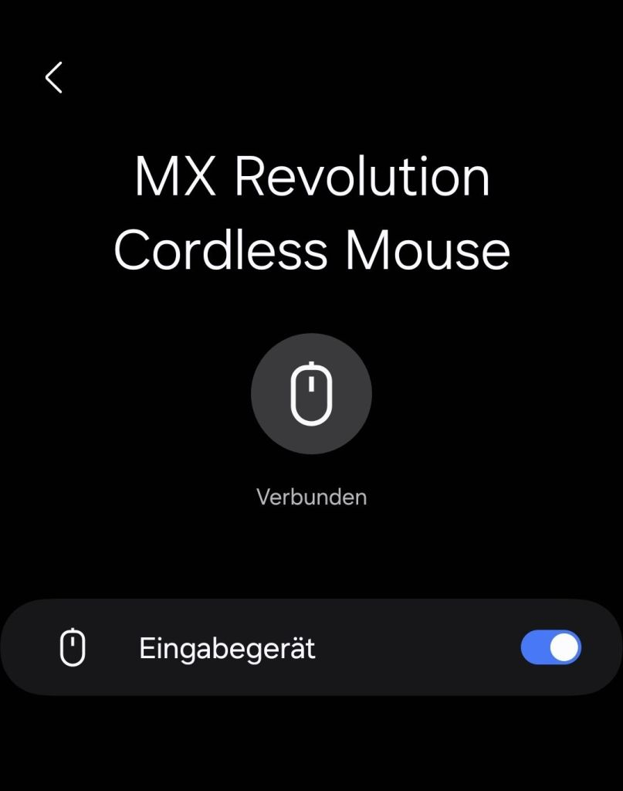

# ESP32 Bluetooth Low Energy Mouse Jiggler

This is a lightweight, invisible ESP32 powered Bluetooth mouse jiggler that helps your PC to stay awake while you're on the toilet or taking a break.

<table>
  <tr>
    <td></td>
    <td></td>
  </tr>
</table>

## Features
- Bluetooth Low Energy (BLE) HID device emulation
- **Powered by NimBLE-Arduino**: Efficient and lightweight BLE library for the ESP32 ([GitHub Repo](https://github.com/h2zero/NimBLE-Arduino), [Documentation](https://h2zero.github.io/esp-nimble/))
- Moves the mouse periodically to keep your system active
- Simple to set up with the ESP32 and Arduino framework

## Disclaimer
The VID and PID values used in this project correspond to specific Logitech devices. These values are intended for **demonstration and educational purposes only**. For commercial or production use, please obtain the necessary licenses or use your own custom VID/PID values.

## Requirements
- ESP32 board (e.g., ESP32 DevKit)
- PlatformIO IDE or Arduino IDE for building and uploading the firmware
- [NimBLE-Arduino](https://github.com/h2zero/NimBLE-Arduino) library for Bluetooth support

## Installation

### Step 1: Install PlatformIO in VSCode
1. **Download and install Visual Studio Code (VSCode)** from [https://code.visualstudio.com](https://code.visualstudio.com).
2. **Install the PlatformIO extension**:
    - Open VSCode.
    - Go to the **Extensions** view by clicking on the Extensions icon on the left sidebar or pressing `Ctrl+Shift+X`.
    - Search for "PlatformIO" and click **Install** on the PlatformIO IDE extension.
3. After installation, the PlatformIO toolbar should appear at the bottom of the VSCode window.

### Step 2: Clone the Project
1. **Clone the repository**:
    - Open a terminal and run the following command to clone this project:
      ```bash
      git clone https://github.com/joedust/esp32-ble-mouse-jiggler.git
      ```
    
2. Open the cloned project in **VSCode**.

### Step 3: Build and Upload the Firmware

1. **Select the correct environment**:
    - In the **PlatformIO** toolbar at the bottom of VSCode, ensure that the correct board is selected (e.g., `esp32doit-devkit-v1` or any other ESP32 board you're using).
  
2. **Build the project**:
    - Click on the **checkmark icon** (Build) on the left side of the PlatformIO toolbar, or press `Ctrl+Alt+B` to trigger the build process. This will compile the firmware based on the configuration in the `platformio.ini` file.

3. **Upload the firmware to the ESP32**:
    - Once the build process completes, connect your ESP32 to the computer using a USB cable.
    - Click on the **arrow icon** (Upload) on the left side of the PlatformIO toolbar, or press `Ctrl+Alt+U` to upload the firmware to the ESP32 board.

4. **Monitor the serial output**:
    - After uploading, you can monitor the serial output by clicking on the **plug icon** (Serial Monitor) in the PlatformIO toolbar, or press `Ctrl+Alt+M`. This will show the log output from the ESP32, where you can verify that it is running correctly.

## Usage
- After uploading the code, the ESP32 will start advertising as a Bluetooth HID device.
- When connected to your computer, it will periodically simulate mouse movements to prevent your system from going idle.

## License
This project is for educational and demonstration purposes only. Use at your own risk.
